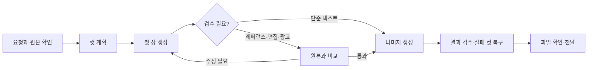

<div align="center">


**한 장의 아이디어를, 검수한 이미지 파일로.**

[](https://github.com/HeiTuz/ImgGen2/releases/latest) [](https://github.com/HeiTuz/ImgGen2/actions) [](LICENSE)

[설치](#설치) · [무엇을 만들 수 있나요](#무엇을-만들-수-있나요) · [사용법](#사용법) · [업데이트](#업데이트) · [문서](#문서)

</div>

ImgGen2는 Codex 구독 경로로 이미지를 만들고, 레퍼런스가 필요한 작업은 원본과 비교하며, 실패한 컷만 다시 만드는 에이전트 스킬입니다. **정확한 수량, 이어서 작업하기, 실제 파일 확인**까지 한 흐름으로 다룹니다.

MPW는 프롬프트를 만드는 별도 스킬입니다. 통합 설치기에서 **ImgGen2만, MPW만, 둘 다** 선택할 수 있습니다.

## 설치

### 명령은 하나. 필요한 도구만 선택하세요.

```sh
npx --yes --package github:HeiTuz/ImgGen2 imggen-imggen2
```

일반 터미널에서 실행하면 설치할 구성요소와 에이전트 호스트를 선택합니다.

```text
Install what?
  1  ImgGen2   이미지 생성 · 편집 · 배치 제작
  2  MPW       프롬프트 작성 · 변주 · 핸드오프
  3  Both      같은 호스트에 두 스킬 설치
```

| 선택 | 설치되는 것 | 이런 경우에 |
| --- | --- | --- |
| **ImgGen2** | 이미지 스킬, QC 설정, `imggen` 도우미. Codex CLI가 없으면 설치 | 바로 이미지를 만들고 싶을 때 |
| **MPW** | 프롬프트 스킬만. ImgGen2·Codex CLI·QC 설정은 설치하지 않음 | 프롬프트를 작성하거나 다듬을 때 |
| **Both** | 두 스킬을 선택한 호스트에 설치 | 아이디어 변주부터 이미지 제작까지 이어갈 때 |

> Node.js **18 이상**과 Git이 필요합니다. 이미지 제작에는 Python과 로그인된 공식 Codex CLI가 필요하며, CI는 Python 3.12에서 검증합니다. 스킬 설치만으로 이미지 생성이 시작되거나 계정에 로그인되지는 않습니다.

### 선택을 명령에 담기

```sh
# ImgGen2만
npx --yes --package github:HeiTuz/ImgGen2 imggen-imggen2 -- --component imggen2

# MPW만
npx --yes --package github:HeiTuz/ImgGen2 imggen-imggen2 -- --component mpw

# 둘 다
npx --yes --package github:HeiTuz/ImgGen2 imggen-imggen2 -- --component all
```

Bun을 쓴다면 `npx --yes` 대신 `bunx`를 사용합니다.

```sh
bunx --package github:HeiTuz/ImgGen2 imggen-imggen2 -- --component all
```

**CI·비대화형 실행과 `--dry-run`은 질문하지 않습니다.** 선택을 생략하면 ImgGen2만 설치합니다. 자동화에서는 `--component`와 `--agent`를 함께 지정하세요. 이미 설치된 스킬을 교체할 때만 `--force`를 붙입니다.

<details>
<summary><strong>호스트 선택 · 직접 경로 · 독립 MPW 설치</strong></summary>

```sh
# Codex에 두 스킬 설치
npx --yes --package github:HeiTuz/ImgGen2 imggen-imggen2 -- --component all --agent codex

# Claude Code에 MPW만 설치
npx --yes --package github:HeiTuz/ImgGen2 imggen-imggen2 -- --component mpw --agent claude

# 파일을 쓰기 전에 계획 확인
npx --yes --package github:HeiTuz/ImgGen2 imggen-imggen2 -- --component all --agent codex --dry-run
```

| `--agent` | ImgGen2 경로 | MPW 경로 |
| --- | --- | --- |
| `codex` | `~/.codex/skills/ImgGen2` | `~/.codex/skills/MPW` |
| `claude` | `~/.claude/skills/ImgGen2` | `~/.claude/skills/MPW` |
| `hermes` | `~/.hermes/skills/ImgGen2` | `~/.hermes/skills/prompt-writing/MPW` |

`--agent all`은 감지한 호스트 전체를 뜻합니다. `--component all`은 두 스킬을 뜻합니다. 둘은 서로 다른 선택입니다. 비대화형 호스트 자동 감지는 `hermes > claude > codex` 순서이며, 감지 결과가 없으면 Hermes를 사용합니다.

직접 경로는 ImgGen2에 `--target`, MPW에 `--mpw-target`을 사용합니다. `--skip-codex`는 Codex CLI 설치를 생략합니다. 이전 `--skip-mpw`는 ImgGen2만 선택하는 호환 옵션입니다.

MPW 자체 설치기를 바로 호출할 수도 있습니다. 이때 호스트 옵션 이름은 **`--target`**입니다.

```sh
npx --yes --package github:HeiTuz/MPW heituzmpw -- --target codex
```

MPW 자체 설치기의 자동 호스트 기본값은 Claude Code입니다. 두 스킬의 설치 위치를 맞추려면 호스트를 명시하거나 위 통합 설치기를 사용하세요.

</details>

## 무엇을 만들 수 있나요

| 작업 | 요청 예시 | ImgGen2가 챙기는 것 |
| --- | --- | --- |
| **한 장의 장면** | “파란 도자기 컵, 린넨 위의 부드러운 자연광” | 파일 생성, PNG 형식·크기·해시 확인 |
| **레퍼런스 편집** | “제품의 색과 봉제는 그대로, 배경만 바꿔줘” | 원본의 관찰 가능한 특징과 변경 범위 |
| **인물 시리즈** | “이 사람 전신 6장. 인물은 같게, 장소만 다르게” | 동일 인물, 전신 구도, 첫 장 검수 후 나머지 제작 |
| **상품 사진 세트** | “앞·뒤·포켓·소재 컷을 한 세트로 정리해줘” | 제품 구조, 컷별 목적, 누락 없는 결과 목록 |
| **아이디어 탐색** | “독립잡지풍 고양이 이미지 100장” | MPW 프롬프트 변주, 제한된 동시 실행, 실패한 컷만 재시도 |

### 실제 생성 결과


<sub>v1.13.0 릴리스 파일럿 · Codex 구독 경로 · 1402 × 1122 PNG. 파일 구조·해시·픽셀 디코딩과 화면 확인을 마친 실제 생성물입니다. 레퍼런스 재현력이나 종합 화질의 비교 평가를 뜻하지는 않습니다.</sub>

## 사용법

스킬이 설치된 에이전트에게 작업을 요청하세요.

```text
ImgGen2로 이 제품 사진을 상세페이지용 6장으로 만들어줘.
색·실루엣·소재·로고는 유지해.
포켓과 원단 디테일을 각각 한 장 포함하고, 흰 배경으로 통일해.
```

```text
d1 포켓 컷만 다시 만들어줘. 나머지는 유지해.
전체 앞모습 대신 포켓의 봉제와 여밈이 보이는 클로즈업으로.
```

### 생성부터 전달까지



첫 장부터 실패하면 같은 문제를 여러 장으로 늘리지 않습니다. 중간에 끊긴 작업은 기록과 파일 해시로 재개하고, 이미 통과한 컷은 보존합니다. **생성 성공, 검수 통과, 최종 전달을 구분합니다.**

<details>
<summary><strong>CLI로 한 장 만들기 · 배치 실행</strong></summary>

아래 명령은 설치된 스킬 디렉터리에서 실행합니다. `--execute`가 없으면 계획만 확인합니다.

```sh
python scripts/codex_subscription_transport.py --prompt "A blue ceramic cup on natural linen" --output ./cup.png
python scripts/codex_subscription_transport.py --prompt "A blue ceramic cup on natural linen" --output ./cup.png --execute
```

레퍼런스 편집은 `--image ./original.png`을 추가합니다. 단순 텍스트 프롬프트는 MPW가 설치돼 있으면 보강할 수 있고, `--mpw off`로 끕니다.

```sh
python scripts/codex_subscription_batch.py --manifest ./jobs.jsonl --output-root ./results --workers auto --execute
```

배치의 `completion_state`와 `next_action`을 확인하세요. `awaiting_pilot_qc`는 첫 장을 검수할 차례라는 뜻이며, 전체 완료가 아닙니다. 상세 절차는 [배치 계약](references/batch-production-contract.md)에 있습니다.

MPW를 사용하는 텍스트 아이디어 대량 변주는 다음과 같습니다.

```sh
python scripts/creative_batch.py --prompt "독립잡지풍 검은 고양이" --style "editorial, muted palette" --count 100 --output-root ./cats --execute
```

이 프리셋은 텍스트 아이데이션용입니다. 실제 상품을 원본과 동일하게 보정하려면 레퍼런스 기반 상품 제작 절차를 사용하세요.

</details>

## 검수와 결과 관리

- **필요할 때 검수.** 기본 `auto`는 레퍼런스·편집·상품·광고 작업과 명시적 검수 요청에 적용합니다. 단순 텍스트 생성은 파일 무결성만 확인합니다.
- **파일도 확인.** PNG 구조·CRC·크기·해시와 현재 세션의 소유권을 검사합니다. 파일이 있다고 무조건 성공으로 처리하지 않습니다.
- **좋은 컷은 보존.** 실패한 컷만 원본에서 다시 생성합니다. 제품 구조, 동일 인물, 텍스트, 디테일 목적을 따로 확인합니다.
- **설정은 유지.** 재설치 시 기존 QC 설정을 보존합니다. 변경하려면 `--vision-qc auto` 또는 `--vision-qc off`를 명시하세요.

`off`는 시각 검수를 끄며 로컬 파일 검사는 유지합니다. QC는 호스트의 기본 Vision 도구를 사용합니다. Astra는 작업을 진행하는 모델이며, 그 이름을 이미지 생성 모델의 증거로 사용하지 않습니다.

## 업데이트

```sh
# 등록된 구성요소 갱신
imggen update

# 이번에는 한 스킬만 갱신
imggen update --component imggen2
imggen update --component mpw

# 두 스킬 갱신 또는 실행 계획만 확인
imggen update --component all
imggen update --component all --dry-run
```

다시 등록하면 이번에 고른 호스트·구성요소가 `imggen`의 갱신 대상으로 저장됩니다. MPW만 설치하면 이 등록은 변경하지 않습니다.

새 설치는 선택한 구성요소를 기록합니다. 이전 버전의 기록에 선택 정보가 없으면 ImgGen2만 갱신합니다. `--codex`를 추가하면 공식 Codex CLI도 갱신합니다.

**MPW만 설치한 환경에는 `imggen` 도우미가 없습니다.** 통합 명령을 `--component mpw --force`로 다시 실행하거나, MPW 자체 설치기에 `--force`를 붙여 갱신하세요.

<details>
<summary><strong>설치 문제 해결 · 오프라인 · Windows</strong></summary>

- `imggen status`로 실제 경로·버전·등록 상태를 확인합니다. 선택하지 않은 MPW가 없어도 ImgGen2 설치는 정상입니다.
- 온라인 ImgGen2 설치는 필요하면 공식 Codex CLI와 Pillow 설치를 시도합니다. 로그인은 사용자의 Codex 환경에서 진행합니다.
- `--offline`은 ImgGen2 파일 복사용입니다. MPW 또는 두 스킬을 선택한 실설치에는 사용할 수 없습니다. `--dry-run --component all`은 두 설치의 계획만 확인할 수 있습니다.
- `--no-register`는 전역 도우미·설치 기록·셸 설정 등록을 생략합니다. 오프라인에서 등록까지 하려면 `--register`를 명시하세요.
- GitHub 패키지 실행이 패키지 매니저 정책에 막히면 스킬 검색 경로 밖에 소스를 내려받아 설치기를 실행하세요.

```sh
git clone https://github.com/HeiTuz/ImgGen2.git ./ImgGen2-source
node ./ImgGen2-source/scripts/install.mjs --component imggen2 --agent codex
```

Windows는 PowerShell·cmd·Git Bash에서 사용할 수 있습니다. 공백·한글·UNC 경로를 지원하며, 다른 OS의 `/Users/...` 경로를 Windows 경로로 추측하지 않습니다. 구형 launcher 복구는 다음 명령을 사용합니다.

```sh
npx --yes --package github:HeiTuz/ImgGen2 imggen-imggen2 -- --component imggen2 --agent hermes --force --register
```

자세한 경로 규칙은 [실행 계약](references/execution-contract.md), 상품 공유폴더 사용법은 [폴더 배치 예제](examples/dint-shared-folder-apparel-batch.md)를 참고하세요.

</details>

## 문서

| 더 알아보기 | 내용 |
| --- | --- |
| [작업별 제작 절차](references/production-workflows.md) | 초상, 상품, 의류, 배치, 검수 |
| [Astra 실행 설계](references/astra-orchestration.md) | 문서 분리, 상태 판단, 완료 증거 |
| [배치 안정성·확장성](references/reliability-and-scaling.md) | 워커 제한, 공유 해시, 재개, 실패 처리 |
| [명시적 Grok 경로](references/grok-oauth-explicit-routing.md) | Hermes xAI OAuth와 네이티브 도구가 있을 때만 사용 |
| [호스트 오버레이](agents/README.md) | Codex·Claude Code·Hermes 설치 표면 |
| [MPW](https://github.com/HeiTuz/MPW) | 독립 프롬프트 작성 스킬 |

기본 생성은 Codex 구독 경로입니다. Grok·Wan 등 다른 제공자는 명시적으로 요청하고 해당 환경이 준비된 경우에만 사용하며, 실패했다고 다른 제공자로 조용히 전환하지 않습니다.

---

병렬 Codex 워커 구조의 출발점은 [gongnyang/codex-fleet](https://github.com/gongnyang/codex-fleet)입니다. 기능을 그대로 복제하기보다 세션 소유권, 검수, 재개·게시 검증을 더했습니다. [구현 비교](references/reliability-and-scaling.md)

**MIT · [HeiTuz](https://github.com/HeiTuz)**
